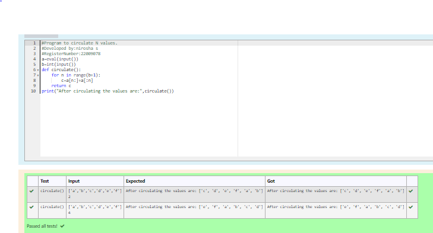

# Circulate-the-values-of-N-variables

## Aim:
To write a python program to circulate the n variables using function concept

## Equipment’s required:
PC
Anaconda - Python 3.7

## Algorithm: 
## Step 1: 
Get the two values from the user

## Step 2: 
Assign the value of the second varible to a temporary varible

## Step 3: 
Assign the value of the first varible to the second variable

## Step 4: 
Assign the value in temporary variable to the first variable

## Step 5: 
Print both the values it would be interchanged

## Step 6: 
End the program

## Program:
```python
#Program to circulate N values.
#Developed by:nirosha s
#RegisterNumber:22009078
a=eval(input())
b=int(input())
def circulate():
    for n in range(b+1):
        c=a[n:]+a[:n]
    return c
print("After circulating the values are:",circulate())
```
## Output:


## Result:
Thus the circulata the values of N-variables are succesfully solved using python programming